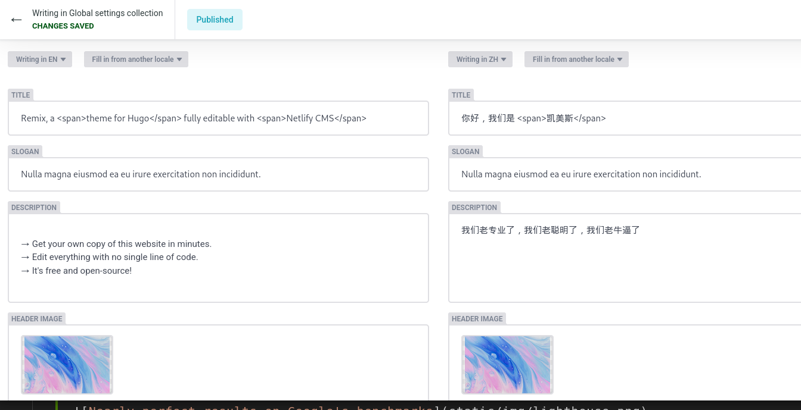

# Remix, a theme for Hugo featuring Netlify CMS


[](https://remix.roneo.app)

- [Demo](https://remix.roneo.app)
- Source code: [Gitlab](https://gitlab.com/Roneo/hugo-remix-one-click-netlify-cms.git) | [Github](https://github.com/RoneoOrg/hugo-remix-one-click-netlify-cms)

<div align="center">

[](https://app.netlify.com/start/deploy?repository=https://github.com/RoneoOrg/hugo-remix-one-click-netlify-cms&stack=cms)

</div>

## Features

- [Deploy to Netlify](https://app.netlify.com/start/deploy?repository=https://github.com/RoneoOrg/hugo-remix-one-click-netlify-cms&stack=cms) in minutes
- Edit everything with [Netlify CMS](https://www.netlifycms.org/)
- Multilingual support
- Dark and light themes
- No external librairies
- Fully responsive
- Easy customization with [CSS variables](https://github.com/RoneoOrg/hugo-remix-one-click-netlify-cms/blob/main/assets/normalize.scss)
- Contact form
- [Font Awesome 6](https://fontawesome.com/search?m=free)
- Respectable [results on Google Lighthouse](https://googlechrome.github.io/lighthouse/viewer/?psiurl=https%3A//remix.roneo.app/&strategy=mobile&category=performance&category=accessibility&category=best-practices&category=seo):


## Getting started


### Deploy to Netlify

[Follow this link](https://app.netlify.com/start/deploy?repository=https://github.com/RoneoOrg/hugo-remix-one-click-netlify-cms&stack=cms) to deploy to Netlify.

Netlify CMS is automatically activated, along with required features (Netlify Identity and the Git Gateway).

When your site is ready, you will receive an email from Netlify allowing you to set up your password and access the CMS.

### Run locally

1. [Install Hugo](https://gohugo.io/getting-started/installing/).  
Hugo versions 0.71, 0.80 and 0.96 was successfully tested. Note that Hugo **extended** is required. 
2. Clone the repo: `git clone https://gitlab.com/Roneo/hugo-remix-one-click-netlify-cms.git remix`
3. Run: `cd remix && hugo server`

## Acknowledgements

Remix is based on [Kimix](https://github.com/OhBonsai/kimix), by [OhBonsaï](https://github.com/OhBonsai). See [CHANGELOG.md](/CHANGELOG.md) for a diff.

## Screenshots

### Dark theme


### Light theme


### Netlify CMS / Homepage


### Global settings



### Edition


### Media management


## License

[Remix](https://github.com/RoneoOrg/hugo-remix-one-click-netlify-cms) is released under the [Apache 2.0 license](https://github.com/RoneoOrg/hugo-remix-one-click-netlify-cms/blob/main/LICENSE)

<div align="center">

[](https://app.netlify.com/start/deploy?repository=https://github.com/RoneoOrg/hugo-remix-one-click-netlify-cms&stack=cms)

</div>

<!-- 
### code tree
```
├─assets                // CSS folder.  coding here
├─content               // Data 
│  ├─news
│  └─products
├─data                  // Website Meta Data. Using $site.data in template
├─layouts               // Html folder.  coding here
│  ├─news              
│  ├─partials
│  └─_default
├─resources             // Auto gen. Ignore it
│  └─_gen
│      ├─assets
│      │  └─scss
│      └─images
└─static
    ├─admin
    ├─files
    └─media
``` -->