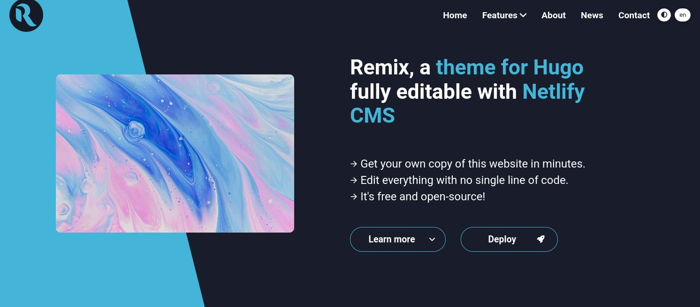
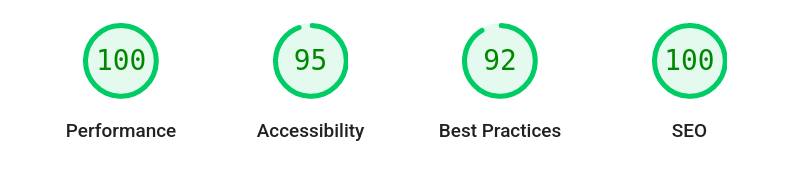
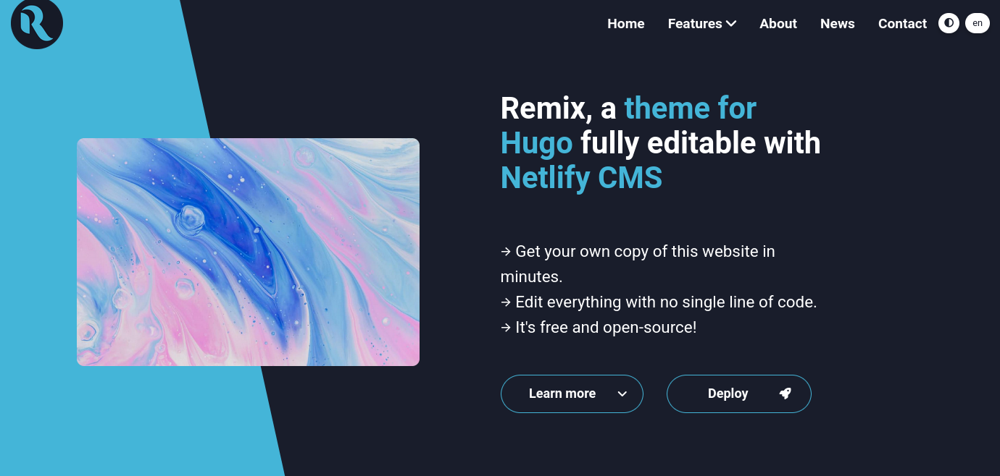
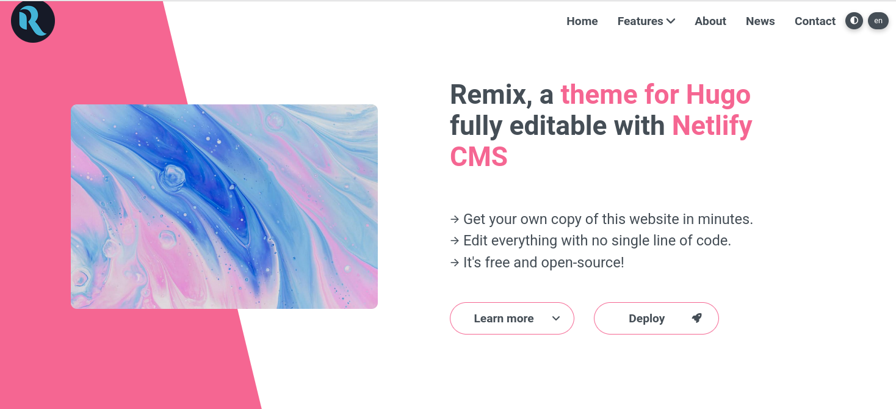
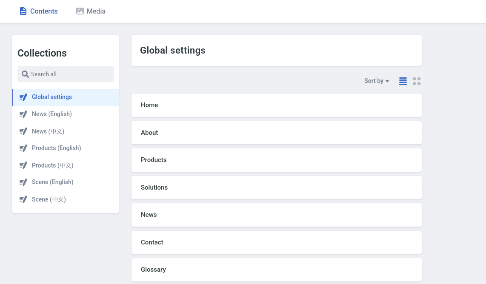
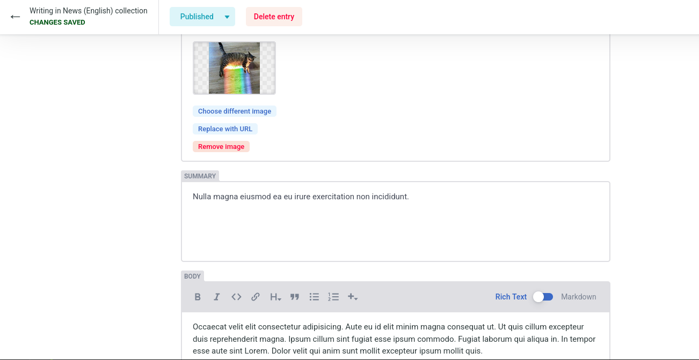
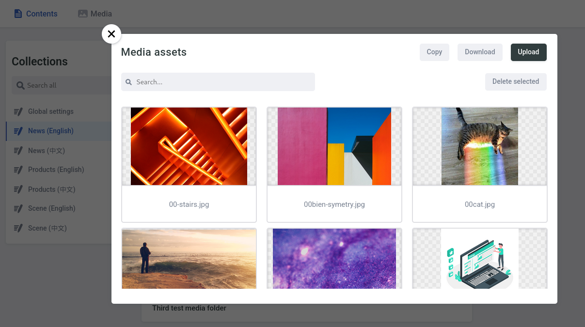

# Deploy Hugo + Netlify CMS in minutes!


[](https://remix.roneo.app)

- [Demo](https://remix.roneo.app)
- Source code: [Gitlab](https://gitlab.com/Roneo/hugo-remix-one-click-netlify-cms.git) | [Github](https://github.com/RoneoOrg/hugo-remix-one-click-netlify-cms)
- Deployment:

<div align="center">

[](https://app.netlify.com/start/deploy?repository=https://github.com/RoneoOrg/hugo-remix-one-click-netlify-cms&stack=cms)

</div>

## Features

- [Deploy to Netlify](https://app.netlify.com/start/deploy?repository=https://github.com/RoneoOrg/hugo-remix-one-click-netlify-cms&stack=cms) in minutes
- Hassle-free edition with [Netlify CMS](https://www.netlifycms.org/)
- Dark and light themes
- Fully responsive
- Beginner-friendly: no submodule, no npm required
- Multilingual support
- Easy customization with [CSS variables](https://github.com/RoneoOrg/hugo-remix-one-click-netlify-cms/blob/main/assets/normalize.scss)
- Contact form
- [Font Awesome 6](https://fontawesome.com/search?m=free)
- Excellent [results on Google Lighthouse](https://googlechrome.github.io/lighthouse/viewer/?psiurl=https%3A//remix.roneo.app/&strategy=mobile&category=performance&category=accessibility&category=best-practices&category=seo):




## Getting started


### Deploy to Netlify

You can generate your own website based on Remix with [this link](https://app.netlify.com/start/deploy?repository=https://github.com/RoneoOrg/hugo-remix-one-click-netlify-cms&stack=cms). You will be guided through the following steps:

1. this repo will be duplicated on Github or Gitlab. An account is required and will be created on the way if needed.
2. [Netlify](https://www.netlify.com/) will then use these files to build your website. Hosting, SSL certificate and domain are automatically set up. For free!
3. When your website is ready, Netlify sends you an email with an invitation link. Open this link, set up your password and you are in!


### Run locally

1. [Install Hugo](https://gohugo.io/getting-started/installing/).  
Hugo versions 0.71, 0.80 and 0.96 was successfully tested. Note that Hugo **extended** is required.
2. Clone the repo: `git clone https://gitlab.com/Roneo/hugo-remix-one-click-netlify-cms.git remix`
3. Run: `cd remix && hugo server`

## Acknowledgements

Remix is based on [Kimix](https://github.com/OhBonsai/kimix), by [OhBonsaï](https://github.com/OhBonsai). See [CHANGELOG.md](/CHANGELOG.md) for a diff.

## Screenshots

### Dark theme



### Light theme



### Netlify CMS / Homepage



### Edition



### Media management




## License

[Remix](https://github.com/RoneoOrg/hugo-remix-one-click-netlify-cms) is released under the [Apache 2.0 license](https://github.com/RoneoOrg/hugo-remix-one-click-netlify-cms/blob/main/LICENSE)

## Contribute

This project is open to contribution. I personnaly [use this Gitlab repo](https://gitlab.com/Roneo/hugo-remix-one-click-netlify-cms/-/boards/4323820) but feel free to open a ticket or submit a PR [on Github](https://github.com/RoneoOrg/hugo-remix-one-click-netlify-cms)

## Going further

- Please star this repo [on Github](https://github.com/RoneoOrg/hugo-remix-one-click-netlify-cms) or [Gitlab](https://gitlab.com/Roneo/hugo-remix-one-click-netlify-cms), to help this project gain some visibility and reach new contributors
- To get more, follow me [on Github](https://github.com/RoneoOrg) or [Gitlab](https://gitlab.com/Roneo), and checkout my [recent posts on Hugo](https://roneo.org/en/)


<!-- 
### code tree
```
├─assets                // CSS folder.  coding here
├─content               // Data 
│  ├─news
│  └─products
├─data                  // Website Meta Data. Using $site.data in template
├─layouts               // Html folder.  coding here
│  ├─news              
│  ├─partials
│  └─_default
├─resources             // Auto gen. Ignore it
│  └─_gen
│      ├─assets
│      │  └─scss
│      └─images
└─static
    ├─admin
    ├─files
    └─media
``` -->
